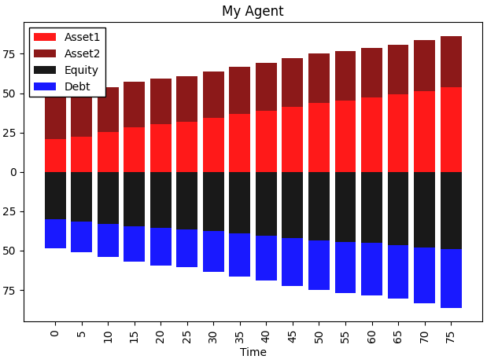

Balance Sheet Example
=========================

.. code-block:: python 

    from sfctools import Agent, BalanceSheet, BalanceEntry
    import numpy as np 

    class MyAgent(Agent):
        """
        An example agent
        """
        def __init__(self):
            super().__init__()
            
            self.change_equity(20.0,"Asset1")
            self.change_equity(10.0,"Asset2")
            self.change_debt(18.0)
            
        def change_equity(self,q,which): # increase or decrease equity by q / -q 
            with self.balance_sheet.modify:
                self.balance_sheet.change_item(which,BalanceEntry.ASSETS,q)
                self.balance_sheet.change_item("Equity",BalanceEntry.EQUITY,q)
        
        def change_debt(self,q): # increase or decrease debt by q / -q
            with self.balance_sheet.modify:
                self.balance_sheet.change_item("Debt",BalanceEntry.LIABILITIES,q)
                self.balance_sheet.change_item("Asset2",BalanceEntry.ASSETS,q)
        
        def swap_assets(self,q): # swap between assets
            try:
                with self.balance_sheet.modify:
                    self.balance_sheet.change_item("Asset2",BalanceEntry.ASSETS,-q)
                    self.balance_sheet.change_item("Asset1",BalanceEntry.ASSETS,q)
            except:
                pass
                
        def update(self):
        
            q1 = 0.5*(np.random.rand())
            q2 = 0.5*(np.random.rand())
            q3 = .4*np.random.rand()
            
            self.change_equity(q1,"Asset1")
            self.change_debt(q1)
            self.swap_assets(q3)
            

    my_agent = MyAgent() # create an agent 

    my_balances = [] # allocate empty list

    for i in range(80): # iterate simulation 
        my_agent.update()
        my_balances.append(my_agent.balance_sheet.raw_data) # append balance sheet data to list 
        

    # plot balance sheet evolution 
    BalanceSheet.plot_list(my_balances, dt=5, xlabel="Time", title="My Agent", show_liabilities=True)

Output: 

