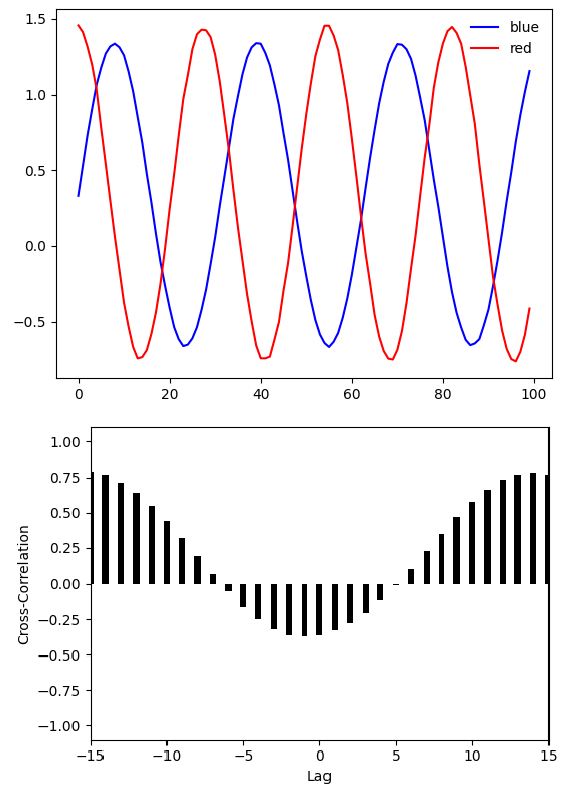

Cross-correlation
===================

.. code-block:: python

    from sfctools.misc.timeseries import cross_correlate_plot
    import numpy as np 
    import matplotlib.pyplot as plt 

    def myfun1(t):
        a = 1.0 
        b = 0.2
        c = 0.33
        d = 0.02
        return a*np.sin(b*t) + c + d* np.random.rand()
        
        
    def myfun2(t):
        a = 1.1 
        b = 0.23
        c = 0.33
        d = 0.04
        return a*np.cos(b*t) + c + d* np.random.rand()

    t = np.linspace(0,99,100)

    x = [myfun1(ti) for ti in t]
    y = [myfun2(ti) for ti in t]

    plt.figure()
    plt.plot(x,color="blue",label="blue")
    plt.plot(y,color="red",label="red")
    plt.legend(framealpha=0.0)
    plt.show()

    cross_correlate_plot(x,y)

Output: 

