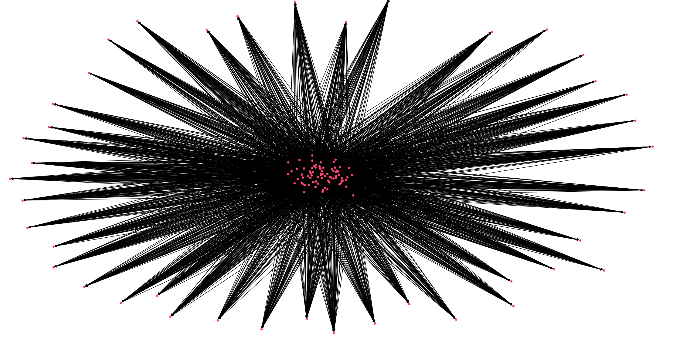

Market Example
===============

.. code-block:: python

    from sfctools import MarketMatching, Agent
    import numpy as np 

    # define a rudimentary trader class 

    class Trader(Agent): 
        # a rudimentary trader
        def __init__(self):
            super().__init__()

    supply_traders = [Trader() for i in range(80)]
    demand_traders = [Trader() for i in range(42)] # generate some agents 

    # define a market and a matching rule 
    
    class Market(MarketMatching):
        """
        My market for matching supply and demand
        """
        def __init__(self):
            super().__init__()
        
        def rematch(self):
            # match the suppliers and demanders at random
            
            for i in self.demand_list:
                for j in self.supply_list:
                    
                    u = np.random.rand()
                    if u > 0.3:
                        self.link_agents(j,i,u)

    # generate a market and add the traders
    my_market = Market()
    [my_market.add_demander(agent) for agent in demand_traders]
    [my_market.add_supplier(agent) for agent in supply_traders]

    # re-match the market traders
    my_market.rematch()

    # plot the resulting network 
    my_market.plot()

    # print suppliers of demander 0 
    print(my_market.get_suppliers_of(demand_traders[0]))

Output: 

[<Agent: Trader__00002>, <Agent: Trader__00003>, <Agent: Trader__00004>, <Agent: Trader__00005>, <Agent: Trader__00007>, <Agent: Trader__00008>, <Agent: Trader__00009>, <Agent: Trader__00010>, <Agent: Trader__00011>, <Agent: Trader__00013>, <Agent: Trader__00014>, <Agent: Trader__00019>, <Agent: Trader__00020>, <Agent: Trader__00021>, <Agent: Trader__00022>, <Agent: Trader__00023>, <Agent: Trader__00024>, <Agent: Trader__00025>, <Agent: Trader__00026>, <Agent: Trader__00028>, <Agent: Trader__00029>, <Agent: Trader__00030>, <Agent: Trader__00031>, <Agent: Trader__00032>, <Agent: Trader__00034>, <Agent: Trader__00035>, <Agent: Trader__00036>, <Agent: Trader__00037>, <Agent: Trader__00039>, <Agent: Trader__00040>, <Agent: Trader__00041>, <Agent: Trader__00043>, <Agent: Trader__00044>, <Agent: Trader__00045>, <Agent: Trader__00046>, <Agent: Trader__00047>, <Agent: Trader__00048>, <Agent: Trader__00050>, <Agent: Trader__00051>, <Agent: Trader__00052>, <Agent: Trader__00053>, <Agent: Trader__00055>, <Agent: Trader__00059>, <Agent: Trader__00061>, <Agent: Trader__00062>, <Agent: Trader__00063>, <Agent: Trader__00064>, <Agent: Trader__00065>, <Agent: Trader__00067>, <Agent: Trader__00068>, <Agent: Trader__00070>, <Agent: Trader__00071>, <Agent: Trader__00073>, <Agent: Trader__00074>, <Agent: Trader__00076>, <Agent: Trader__00077>, <Agent: Trader__00078>, <Agent: Trader__00080>]
