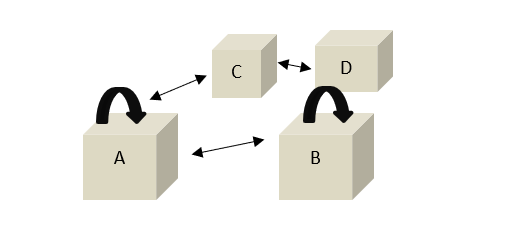
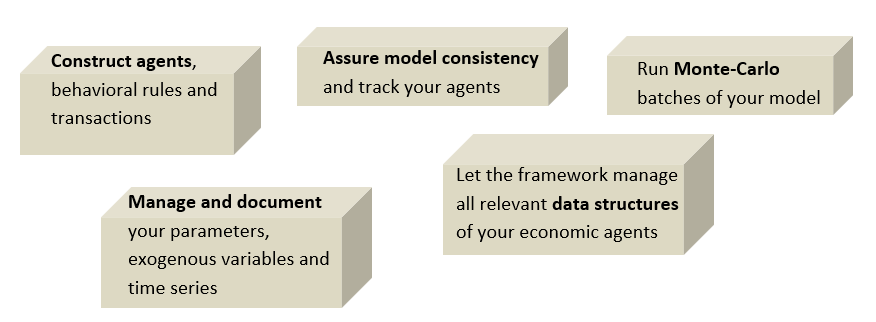

Context and Scope
============================

Agent-Based Computational Economics
------------------------------------

**Agent-based computational economics** is a modeling approach where independent myopic units, called agents, interact. The outcome of this interaction (called emergence) can be a self-organized pattern much more complicated than the individual agents’ behavioral rules :cite:p:`gatti2008emergent,gaffeo2008adaptive`. In Agent-Based Computational Economics, the agents are the types economic actors, such as individual firms or plant operators, performing certain operations such as
investment or bidding at markets. There is, however, a large plurality of different agent-based economic models.
Agent-based *macroeconomic* models are typically constructed of households, firms, banks, the government
and a central bank, who are either aggregate entities or interact in a bottom-up fashion :cite:p:`turrell2016agent`. A more detailed elaboration on agent-based comutational eonomics can be found, for example, in the two books: :cite:p:`tesfatsion2006handbook,gallegati2017introduction`.

**The framework sfctools** facilitates basic datastructures to ensure a numerically and logically consistent, clear and simple modeling environment for economic
models at the micro- and macro scale. It is especially suitable for macroeconomics, however it also offers a more general functionality and can be used in other research fields.

Stock-Flow Consistency
----------------------

The appealing framework of sfctools builds around the Stock-Flow-Consistency (SFC) principle. The latter is a main
feature of state-of-the-art macroeconomic (agent-based) models :cite:p:`zezza2019design,caiani2016agent, reissl2021heterogeneous`. It originates
from the pioneering work of Copeland :cite:p:`copeland1949social` and later Dos Santos :cite:p:`dos2008simplified` and has since then found application in
many modeling exercises. The principle of stock-flow consistency applies to a wide spectrum of economic
streams, ranging from Hydraulic Keynesianism :cite:p:`andresen1998macroeconomy` to Post-Keynesianism :cite:p:`caverzasi2015post` and other schools of thinking. [#f1]_
It is therefore a versatile and widely applicable approach. The main idea is that the stocks (changes within an agent) and the flows (between agents) have to be consistent, just as stated in the Laws of Thermodynamics.
The concept is therefore especially suitable for ecological macroeconomic models :cite:p:`dafermos2014ecological`.

.. [#f1] For an essay on economic modeing streams, have a look at :cite:p:`dosi2019more`.

What can I do wih sfctools?
---------------------------

The **framework sfctools** will accompany your modeling work along the whole model design process. Typically modelers will start with constructing their agents, i.e. the transactions between agents and their behavioral parameters. 
Sfctools supports modelers with a **basic Agent class**. All agents which inherit from this class will automatically be equipped with datastructures, the most important being the balance sheet. A **flow matrix** sheet collects all cash flows between agents, as well as changes in stocks. 
Structural **model parameters** can be read from a **simple yaml file** to avoid hard-coding. Finally, sfctools will take care about timing your simulation periods and executing batch simulation runs.

Literature References
---------------------- 

.. bibliography:: ../literature_architecture.bib
   :cited:

