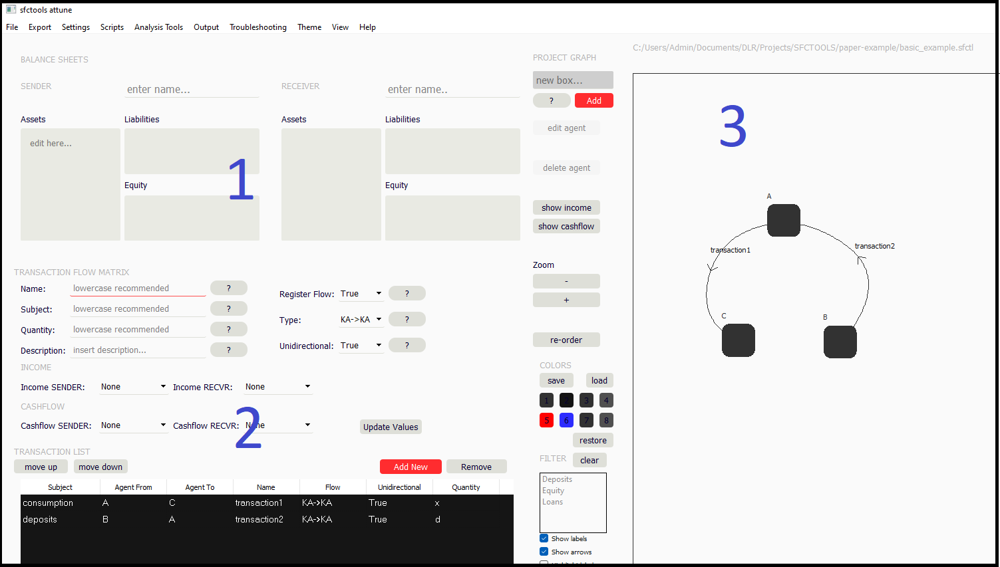

# Summary

One of the most challenging tasks in macroeconomic models is to describe the macro-level effects from the collective behavior of meso- or micro-level actors. Wheras in 1759, Adam Smith was still making use of the concept of an 'invisible hand' ensuring market stability and economic welfare [@rothschild1994adam], a more and more popular approach is to make the 'invisible' visible and to accurately model each actor individually by defining its behavioral rules and myopic knowledge domain [@castelfranchi2014making;@cincotti2022we]. In agent-based computational economics (ACE), economic actors correspond to dynamically interacting entities (also called agents) who live inside a computer program [@tesfatsion2002agent;@klein2018agent;@axtell2022agent]. Agent-based modeling is a powerful approach utilized in economic simulations to generate complex dynamics, endogenous business cycles and market disequilibria. For many research topics, it is useful to combine agent-based modeling (ABM) with the stock-flow consistent (SFC) paradigm [@nikiforos2018stock;@caverzasi2015post;@caiani2016agent]. These models ensure there are no 'black holes', i.e. inconsistent sources or sinks, in an economic model. SFC-ABM models, however, are often intransparent and rely on very peculiar, custom-built data structures, thus hampering accessibility [@bandini2009agent;@hansen2019agent]. A tedious task is to generate, maintain and distribute code for agent-based models  (ABMs), as well as to check for the inner consistency and logic of such models.

# Statement of need

 **sfctools** is an ABM-SFC modeling toolbox, which i) relies on transparent and robust data structures for economic agents, ii) comes along with a simple descriptive modeling approach for agents, iii) provides an easy project builder for Python, making the software runnable and accessible on a large number of platforms, and iv) is also manageable from a graphical user interface for ABM-SFC modeling, shipped as part of the toolbox, assuring analytical SFC-check and double accounting consistency. The package is shipped in the form of an open-source project. Unlike more generic frameworks like [*mesa*](https://github.com/projectmesa/mesa/) or [*AgentPy*](https://github.com/joelforamitti/agentpy) [@Foramitti2021], it concentrates on agents in economics.
*sfctools* was designed to be used by both engineering-oriented and economics-oriented scholars who have basic education in both fields. It can be used by a single developer or by a small development team, splitting the work of model creation in terms of consistency and economic logic from the actual programming and technical implementation. This allows software solutions from rapid prototyping up to more sophisticated, medium-sized ABMs. Sfctools is therefore a versatile virtual laboratory for agent-based economics.

# Basic structure

Figure \ref{struct} Shows the basic structure of the modeling framework. The framework designed to complement an efficient model creation workflow. Users can either program their models directly, using the sfctools Python package, or can use the graphical user interface to design their models at all stages. This refers to the implementation of behavioral rules and structural parameters (green boxes), and the design of a set of individual balance sheet transactions (plain gray box). Once the basic model setup is created, the users can check for stock-flow consistency by analytically examining the transaction flow matrix, taking all theoretically allowed balance sheet transactions into account. When running the model, the aggregate and disaggregate transaction flow matrix is available also as a numerical result. The same is true for data structures on the individual agent level (yellow box): the balance sheets, income statements and cashflow statements of individuals can be consistently logged and accessed on runtime or ex-post. In the background, the sfctools core framework will take care of all computational operations and thereby assure stock-flow consistency at all times.

Figure \ref{attune} shows a screenshot of ther user interface **attune**  (**A**gen**T**-based **T**ransaction and acco**UN**ting graphical user interfac**E**) shipped along with the *sfctools* framework. In this simple graphical interface, transactions can be edited, sorted and graphically analyzed. Also, strucutral parameters are edited in form of a yaml-styled summary. The GUI allows for several development productivity tools, such as the analytical pre-construction of the transaction flow matrix. The main window of the GUI consists of three sub-panels: First, it shows the transaction panel (1). Here, the user can directly access the balance sheets of the 'sender' and the 'receiver' agent, which are both equipped with a double entry balance sheet system. Also, the entries for income and cash flow can be manually set in this transaction, and the user can define which flows and stocks are addressed. Second, the user can access already created transactions within the transaction view (2). Here, transactions can be edited, deleted or sorted. All details for transactions are given here as an overview. Third, a graphical representation of the agents is generated in the graph view (3), where different flows are visualized and can be filtered by balance sheet items or by involved agents in an interactive way. The user can freely layout and colorize the created agent relations in a graph structure.

# Model example

Let us consider a simple model example, namely a three-agent model consisting of a consumer agent A, a bank (B) and a consumption good producer (C). We employ two transactions. In the first transaction, B grants a loan to A. Subsequently, A uses its bank deposits to obtain some goods at C. In this simple model, the first transaction only affects the stocks, whereas the second transaction (consumption) is an actual flow.

The model creation workflow is as follows

1. Set up the agents: we add three agents A,B and C to the model graph. Each node will contain a construction plan for an agent.

2. Set up the transactions (edges). Agent A is a consumer and is affected both by transaction 1 and by transaction 2, agent B is a bank and is affected only by transaction 1, agent C is a consumption good producer and is affected only by transaction 2.

Once the transactions are registered in the project, they can be deliberately used during the simulation by importing them from an atuomatically-generated *transaction.py* file.

3. Generate transaction flow matrix: to ensure our model is fully stock-flow consistent, we check if all rows and columns of the transaction flow matrix sum up to zero.

|                       | A    | B  | C  | Total |
|-----------------------|------|----|----|-------|
| Consumption           | -x   | 0  | +x | 0     |
| $\Delta$ Deposits     | -d+x | +d | -x | 0     |
| $\Delta$  Loans       | +d   | -d | 0  | 0     |
| Total                 | 0    | 0  | 0  | 0     |

3. Insert behavioral rules for the agents

4. By exporting our model to python code via saving the project from the GUI, we automatically generate a fully consistent model, usable in any python script.

Thanks to the user friendliness of sfctools, there is little work to be done in terms of coding. In the GUI, we have the possibility to code the three agents in the (python-based) **MA**croecono**M**ic agent**BA**sed language (**MAMBA** language), a custom-designed agent description language for *sfctools-attune*. The MAMBA code is complemented by a simple Python script to finally run the model. The full example can be found on the project documentation page (sfctools-framework.readthedocs.io/en/latest/ > Examples). 

# Author Contributions
**Thomas Baldauf**: Conceptualization, framework draft, technical implementation, repository maintenance, stock-flow conceptualization, graphical user interface

# Acknowledgements
We want to thank several people for their construtive remarks: Ardi Latifaj during his master thesis work for his exensive feature requests, Researchers at Scuola Superiore Sant'Anna for their critical remarks about the framework concept, Patrick Mellacher for his pre-release feedback, Joel Foramitti for his advice on agent-based open-source development, Jonas Eschmann and Luca Fierro for their feedback on the graphical interface and Patrick Jochem for scientific advice on projects being developed using the framework. Special thanks goes to Benjamin Fuchs (DLR) for extensive code reviews during the pre-release phase and co-maintenance of the repository. Last but not least, I want to thank the Helmholtz for providing funding in the course of the Energy System Transformation (ESD) program (subtopic 1.1).

# References
